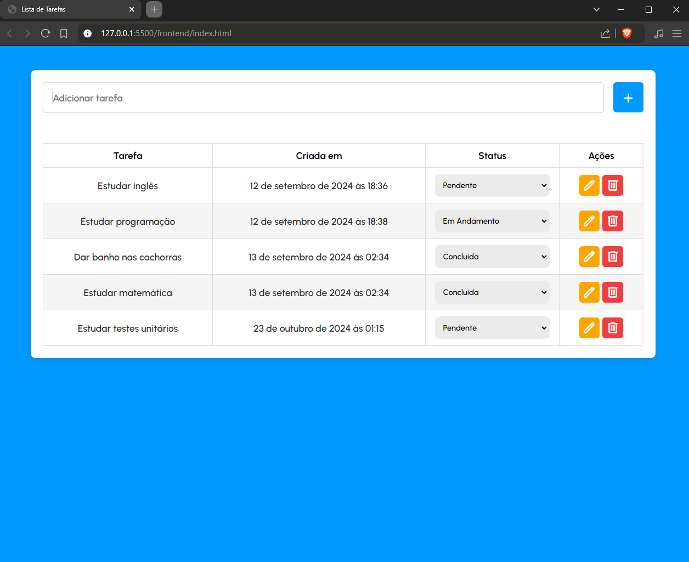

<h1 align="center" style="font-weight: bold;">Todolist 💻</h1>

<h2 id="layout">🎨 Layout</h2>

    

<h2 id="technologies">💻 Tecnologias</h2>

- HTML
- CSS
- Javascript
- Mysql

<h2 id="started">🚀 Objetivos</h2>

**Prática de Manipulação da DOM:**  Praticar a manipulação de elementos na DOM, como adicionar, remover ou modificar itens de lista de forma dinâmica, usando JavaScript. 

**Prática de Fluxos CRUD:**  Implementar o ciclo completo de operações CRUD no front-end, permitindo que o usuário crie, visualize, edite e exclua tarefas.

**Aprender a Trabalhar com Estados e Eventos:**  Aprender a manipular o estado da aplicação e reagir a eventos do usuário.

**Implementação de Middleware para Processamento de Requisições:**  Aprender a integrar middleware para interceptar, processar ou validar requisições antes de atingir a lógica principal.

<h2>📫 Como Me Encontrar</h2>

LinkedIn: [Bruna Themoteo](https://www.linkedin.com/in/brunathemoteo/)

Email: dev.brunathemoteo@gmail.com
